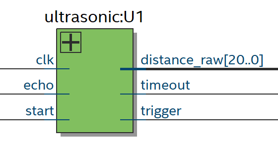

# FPGA-Ultrasonic-sensor
FPGA Ultrasonic sensor controller (SRF05 / HC-SR04)

## Matériels

- carte de développement Terasic Altera DE0-nano
- télémètre ultrason [SRF05](http://www.robot-electronics.co.uk/htm/srf05tech.htm)

Projet développé avec Intel Quartus Prime (lite)
Fichier archive du projet à importer dans Quartus Prime : *ultrasonic.qar*

## Description

clk : horloge (paramètre CLK_MHZ, 50 MHz par défaut)
start : lance une mesure sur impulsion
trigger : à connecter à la broche Trig du capteur
		(paramètre TRIGGER_PULSE_US, 12 us par défaut)
echo : à connecter sur la broche Echo du capteur
new_measure : 1 impulsion si la mesure est complète
timeout : 1 impulsion si timeout (paramètre TIMEOUT_MS, 20 ms par défaut
distance_raw: à lire sur impulsion de new_measure
		donnée image de la largeur du signal Echo codée sur 21 bits
						 
duree du signal echo en microsecondes = distance_raw / CLK_MHZ
	 
Le capteur SRF05 a un timeout de 30 ms si aucun obtacle n'est rencontré.
On peut simuler un timeout inférieur avec le paramètre TIMEOUT_MS
Si le signal Echo n'est pas redescendu après ce TIME_OUT, le contrôleur bloque distance_raw, délivre une impulsion sur la sorte new_measure et sur la sortie timeout.  	
